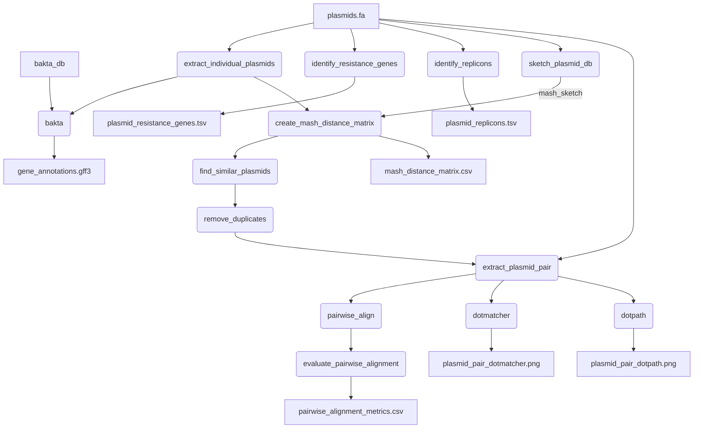

# cluster-plasmids

A workflow for assessing similarity between a set of plasmid sequences.

```mermaid
flowchart TD
plasmids_fasta[plasmids.fa]
bakta_db[bakta_db]
plasmids_fasta --> extract_individual_plasmids(extract_individual_plasmids)
plasmids_fasta --> identify_resistance_genes(identify_resistance_genes)
plasmids_fasta --> identify_replicons(identify_replicons)
bakta_db --> bakta(bakta)
extract_individual_plasmids --> bakta
identify_resistance_genes --> plasmid_resistance_genes[plasmid_resistance_genes.tsv]
identify_replicons --> plasmid_replicons[plasmid_replicons.tsv]
bakta --> gene_annotations[gene_annotations.gff3]
plasmids_fasta --> sketch_plasmid_db(sketch_plasmid_db)
sketch_plasmid_db -- mash_sketch --> create_mash_distance_matrix(create_mash_distance_matrix)
extract_individual_plasmids --> create_mash_distance_matrix
create_mash_distance_matrix --> find_similar_plasmids(find_similar_plasmids)
create_mash_distance_matrix --> mash_distance_matrix[mash_distance_matrix.csv]
find_similar_plasmids --> remove_duplicates(remove_duplicates)
remove_duplicates --> extract_plasmid_pair(extract_plasmid_pair)
plasmids_fasta --> extract_plasmid_pair
extract_plasmid_pair --> pairwise_align(pairwise_align)
extract_plasmid_pair --> dotmatcher(dotmatcher)
dotmatcher --> plasmid_pair_dotmatcher[plasmid_pair_dotmatcher.png]
extract_plasmid_pair --> dotpath(dotpath)
dotpath --> plasmid_pair_dotpath[plasmid_pair_dotpath.png]
pairwise_align --> evaluate_pairwise_alignment(evaluate_pairwise_alignment)
evaluate_pairwise_alignment --> pairwise_alignment_metrics[pairwise_alignment_metrics.csv]
```
